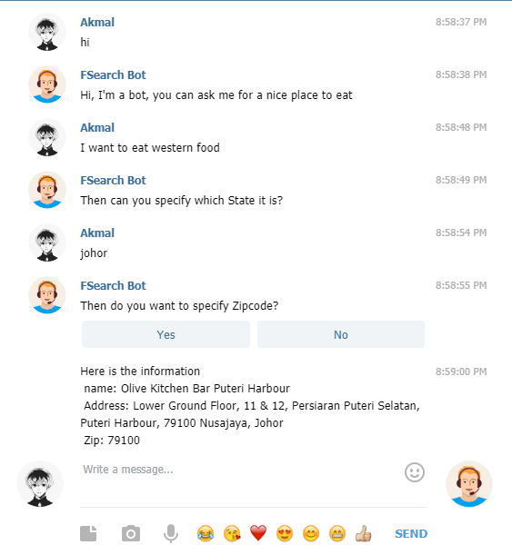
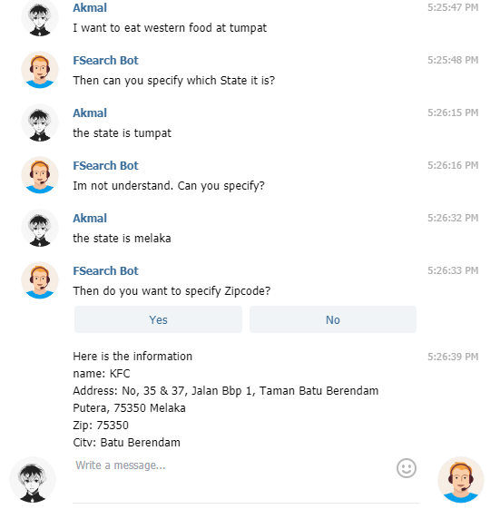
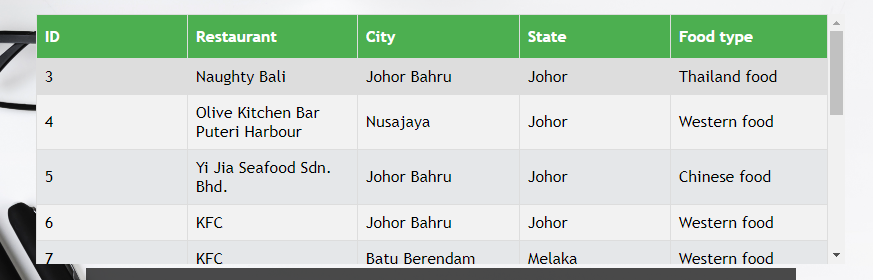
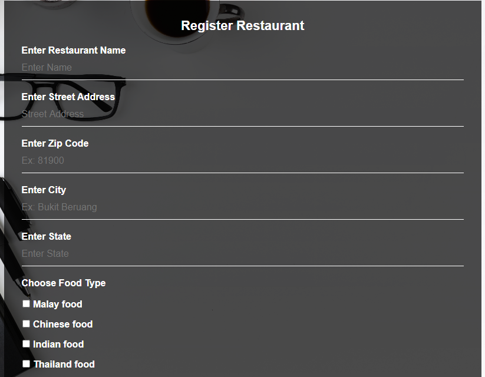

# rasa-chatbot-with-mysql-and-php
This is a demonstration of rasa chatbot interact with user and phpmyadmin

1. Install Anaconda 

2. Install XAMPP

3. Create anaconda anvironment in anaconda command prompt 
- `conda create -n rasa_env python=3.6.3`

4. Activate environment
- `conda activate rasa_env`

5. Install rasa in virtual environment
pip3 install rasa

6. Install Spacy
```text
- pip3 install rasa[spacy]
- python3 -m spacy download en_core_web_md
- python3 -m spacy link en_core_web_md en`
```

7. copy folder psm2 that is inside htdocs to C:\xampp\htdocs

8. To run start apche and mysql in xampp
Then go to http://localhost/phpmyadmin/
- create new database named my_db
- create new table in my_db by using sql code below
- create new table based on the database creation.txt file`

Then go to http://localhost/psm2/login.php

9. Open cmd and change directory to where my_bot folder is

To start action server use:
- `rasa run actions`

To train model use: 
- `rasa train`

To talk or test to chatbot in cmd:
- `rasa shell`

To test confidence level
- `rasa shell nlu`

10. To run in telegram fill the telegram bot token in the credentials.yml file then
- open ngrok.exe and type `ngrok http 5005` then copy the HTTPS link in the ngrok and paste in the credentials.yml

11. Finally to start on telegram just use:
- `rasa run actions`
- Then open new cmd run:
- `rasa run`
- Then chat to the bot that you created on telegram





- The image on the web browser




